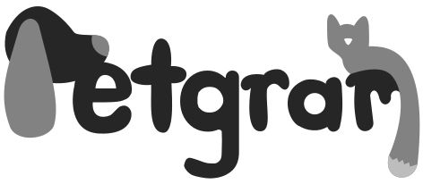
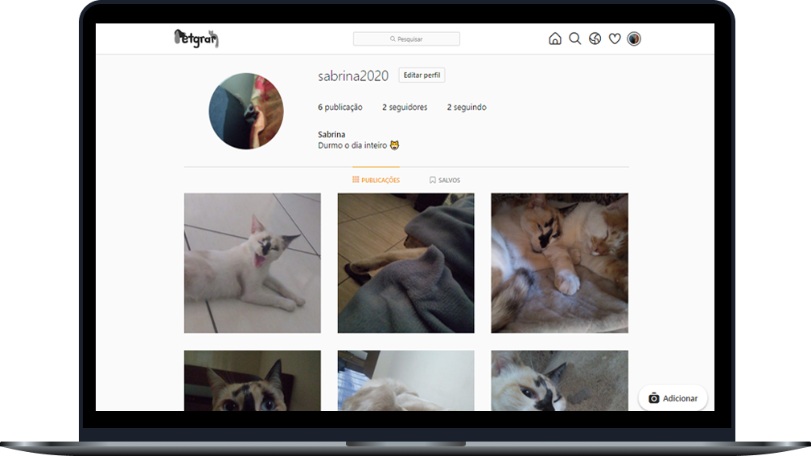

<h1 align="center">
    
</h1>

  <a href="#-tecnologias">Tecnologias</a>&nbsp;&nbsp;&nbsp;|&nbsp;&nbsp;&nbsp;
  <a href="#-projeto">Projeto</a>&nbsp;&nbsp;&nbsp;|&nbsp;&nbsp;&nbsp;
  <a href="#memo-licença">Licença</a>

 

  

## 🚀 Tecnologias

Esse projeto foi desenvolvido com as seguintes tecnologias:

- [PHP](https://www.php.net/)
- [Composer](https://getcomposer.org/)
- [MySQL(MariaDB)](https://mariadb.org/)

## 💻 Projeto

O Petgram foi uma aplicação criada com o intuito de praticar e melhorar meu aprendizado. Nele você tem as principais funções do Instagram: postar fotos, comentar, curtir e seguir quem quiser!

## :memo: Licença

Esse projeto está sob a licença MIT. Veja o arquivo [LICENSE](LICENSE.md) para mais detalhes.
